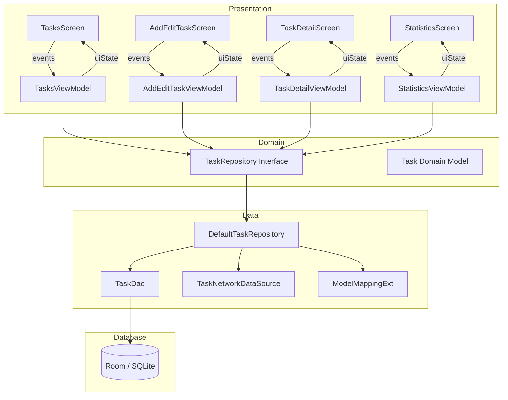
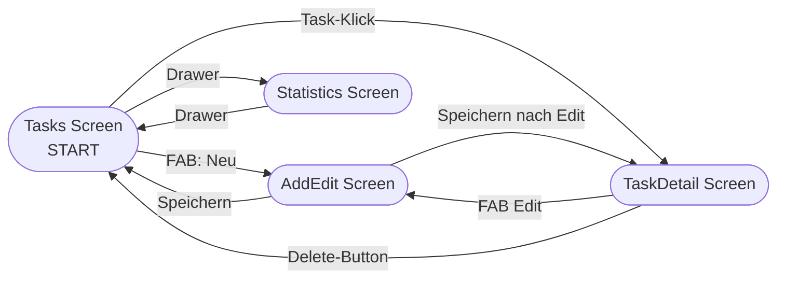

# Architecture Documentation — Procrastinot

> Zielgruppe: Kotlin-/Android-Einsteiger, Studierende, Onboarding
> Konsistent mit: `agents.md` | Für Prüfungsvorbereitung: `reflection-preparation.md`

---

## 1. Projektüberblick

**Procrastinot** ist eine Android To-Do-App, die im Rahmen des Mobile Application Development (MAD) Moduls entwickelt wird.

Der Name ist ein Wortspiel: *procrastinate* (aufschieben) + *not* — „Nicht aufschieben!"

### Hauptfeatures

- Aufgaben erstellen, bearbeiten, löschen
- Aufgaben als erledigt/aktiv markieren
- Aufgaben nach **Priorität** kategorisieren (Hoch / Mittel / Niedrig)
- Aufgaben nach 6 Kriterien **filtern** (Alle, Aktiv, Erledigt, Hoch/Mittel/Niedrig Priorität)
- **Swipe-to-Delete** für intuitive Bedienung
- **Statistiken**: Prozentsatz erledigter und aktiver Aufgaben
- **Persistente Speicherung** via Room (SQLite)
- **Netzwerksynchronisation** (aktuell simuliert/gemockt)
- Navigation über einen **Modal Drawer**

### Plattform & Kerntechnologien

| Kategorie | Technologie |
|---|---|
| Sprache | Kotlin |
| UI | Jetpack Compose (Material 3) |
| Architektur | MVVM + Repository Pattern |
| DI | Hilt |
| Datenbank | Room (SQLite) |
| Asynchronität | Kotlin Coroutines + Flow |
| Reaktiver State | StateFlow |
| Navigation | Navigation Compose |
| Build | Gradle KTS + KSP |

---

## 2. Architekturübersicht

### Verwendete Architektur

Das Projekt verwendet **MVVM** (Model-View-ViewModel) kombiniert mit dem **Repository Pattern** und einer klaren **3-Schicht-Architektur** (Layered Architecture).

```
┌────────────────────────────────────────────────┐
│              PRESENTATION LAYER                │
│   Composables (UI) + ViewModels (State/Logic)  │
│   tasks/, addedittask/, taskdetail/, statistics/│
├────────────────────────────────────────────────┤
│               DOMAIN LAYER                     │
│   Task.kt (Domain Model)                       │
│   TaskRepository.kt (Interface)                │
├────────────────────────────────────────────────┤
│               DATA LAYER                       │
│   DefaultTaskRepository.kt                     │
│   TaskDao, ToDoDatabase (Room)                 │
│   TaskNetworkDataSource (Mock)                 │
│   ModelMappingExt.kt (Konvertierungen)         │
└────────────────────────────────────────────────┘
```

### Warum MVVM?

MVVM trennt UI-Rendering (View) von der Zustandsverwaltung (ViewModel):

1. **Lifecycle-Sicherheit**: ViewModels überleben Konfigurationsänderungen (z.B. Screen-Rotation) — der State geht nicht verloren
2. **Testbarkeit**: ViewModels können ohne Android-Emulator getestet werden (kein `Context` nötig)
3. **Separation of Concerns**: Jede Klasse hat genau eine Verantwortung
4. **Unidirectional Data Flow**: Daten fließen immer in eine Richtung → vorhersehbares Verhalten

### Warum Repository Pattern?

Das Repository ist der **einzige Zugangspunkt zu Daten** für die gesamte Presentation Layer:
- ViewModels wissen nicht ob Daten aus Room, dem Netzwerk oder einem Cache stammen
- Datenquellen sind austauschbar (z.B. echte API statt Mock) ohne ViewModels zu ändern
- Synchronisierungslogik (lokal ↔ Netzwerk) ist an einem Ort zentralisiert

### Unidirectional Data Flow (UDF)

```
    User Action
        │
        ▼
Composable (Event → Lambda)
        │
        ▼
ViewModel (Methode → viewModelScope)
        │
        ▼
Repository (suspend fun)
        │
        ▼
Room/Network (DB ändert sich)
        │
        ▼
Flow emittiert neue Daten
        │
        ▼
ViewModel (StateFlow<UiState> aktualisiert)
        │
        ▼
Composable (collectAsStateWithLifecycle → Recomposition)
        │
        ▼
    Neue UI
```

Daten fließen **immer** von unten nach oben — nie in die andere Richtung. Das macht den State vorhersehbar und Bugs leichter findbar.

---

## 3. Projektstruktur

### Paketname

`at.ac.hcw.procrastinot`

### Vollständige Paketstruktur

```
app/src/main/java/at/ac/hcw/procrastinot/
│
├── MainActivity.kt              ← Single Activity, setzt Compose-UI auf
├── MainApplication.kt           ← @HiltAndroidApp — Hilt-Initialisierung
├── TodoNavGraph.kt              ← NavHost mit allen Composable-Routen
├── TodoNavigation.kt            ← Routendefinitionen, Argumente, NavigationActions
├── TodoTheme.kt                 ← Material3 Theme (Farben, Typographie)
│
├── tasks/                       ← Feature: Aufgabenliste
│   ├── TasksScreen.kt           ← Haupt-Composable (Liste, FAB, Drawer)
│   ├── TasksViewModel.kt        ← State, Filter, CRUD-Koordination
│   └── TasksFilterType.kt       ← Enum: 6 Filtertypen
│
├── taskdetail/                  ← Feature: Aufgaben-Detailansicht
│   ├── TaskDetailScreen.kt      ← Detail-Composable (Text, Checkbox, Edit-FAB)
│   └── TaskDetailViewModel.kt   ← Lädt Task, delete/complete Actions
│
├── addedittask/                 ← Feature: Aufgabe erstellen/bearbeiten
│   ├── AddEditTaskScreen.kt     ← Formular (Titel, Beschreibung, Priorität-Chips)
│   └── AddEditTaskViewModel.kt  ← Formular-State, saveTask-Logik
│
├── statistics/                  ← Feature: Statistiken
│   ├── StatisticsScreen.kt      ← Karten für Aktiv/Erledigt %
│   ├── StatisticsViewModel.kt   ← Lädt Tasks, delegiert Berechnung
│   └── StatisticsUtils.kt       ← getActiveAndCompletedStats() + StatsResult
│
├── data/                        ← Datenschicht (keine UI-Klassen!)
│   ├── Task.kt                  ← Domain-Modell + TaskPriority Enum
│   ├── TaskRepository.kt        ← Interface (Vertrag für Datenzugriff)
│   ├── DefaultTaskRepository.kt ← Implementierung (Room + Network kombiniert)
│   ├── ModelMappingExt.kt       ← Konvertierung: Task ↔ LocalTask ↔ NetworkTask
│   └── source/
│       ├── local/
│       │   ├── LocalTask.kt     ← @Entity (Room-Tabellendefinition)
│       │   ├── TaskDao.kt       ← @Dao (SQL-Abfragen als Kotlin-Funktionen)
│       │   └── ToDoDatabase.kt  ← @Database + MIGRATION_1_2
│       └── network/
│           ├── NetworkDataSource.kt     ← Interface für Netzwerkoperationen
│           ├── TaskNetworkDataSource.kt ← Mock (2s Latenz, In-Memory)
│           └── NetworkTask.kt           ← Netzwerk-DTO + TaskStatus Enum
│
├── di/                          ← Dependency Injection (nur Hilt-Module!)
│   ├── CoroutinesModule.kt      ← Dispatcher- und Scope-Bindings
│   └── DataModules.kt           ← Repository, DataSource, DB-Bindings
│
└── util/                        ← Wiederverwendbare Hilfsmittel
    ├── Async.kt                 ← Sealed class: Loading / Error / Success
    ├── CoroutinesUtils.kt       ← WhileUiSubscribed (5s Sharing-Strategie)
    ├── ComposeUtils.kt          ← LoadingContent() mit SwipeRefresh
    ├── TodoDrawer.kt            ← AppModalDrawer, DrawerButton, DrawerHeader
    ├── TopAppBars.kt            ← TasksTopAppBar, FilterMenu, MoreMenu usw.
    └── SimpleCountingIdlingResource.kt ← Für UI-Tests (Espresso)
```

### Was gehört wo — und was nicht?

| Package | Darf enthalten | Darf NICHT enthalten |
|---|---|---|
| `tasks/` | TasksScreen, TasksViewModel, TasksFilterType | Room-Queries, Netzwerk-Code, allgemeine Utils |
| `data/` | Modelle, Repository, DAOs, DataSources | Composables, ViewModels, DI-Module |
| `di/` | `@Module`-Klassen mit Hilt-Bindings | Business-Logik, UI-Code |
| `util/` | Generische, wiederverwendbare Composables und Helper | Feature-spezifischer Code |

---

## 4. Zuständigkeiten (Responsibilities)

### Composables (View)

**Aufgabe:** UI darstellen, nichts weiter.

```kotlin
// RICHTIG: State empfangen, Events weitergeben
@Composable
fun TasksScreen(
    uiState: TasksUiState,
    onTaskCompleted: (String, Boolean) -> Unit,
    onTaskDeleted: (String) -> Unit,
    onAddTask: () -> Unit
) { /* nur UI */ }

// FALSCH: Composable entscheidet selbst
@Composable
fun TasksScreen() {
    val tasks = repository.getTasks() // NIEMALS direkter Datenbankzugriff!
    if (tasks.isEmpty()) deleteAllTasks() // NIEMALS Business-Logik!
}
```

**Composables im Projekt:**

| Composable | Datei | Zweck |
|---|---|---|
| `TasksScreen()` | tasks/TasksScreen.kt | Liste + FAB + Drawer-Integration |
| `TaskDetailScreen()` | taskdetail/TaskDetailScreen.kt | Detailansicht mit Complete/Delete |
| `AddEditTaskScreen()` | addedittask/AddEditTaskScreen.kt | Formular mit Prioritäts-Chips |
| `StatisticsScreen()` | statistics/StatisticsScreen.kt | Prozent-Karten |
| `LoadingContent()` | util/ComposeUtils.kt | Pull-to-Refresh-Wrapper |
| `AppModalDrawer()` | util/TodoDrawer.kt | Navigation Drawer |

---

### ViewModels (ViewModel Layer)

**Aufgabe:** UI State verwalten und Business-Logik koordinieren.

```kotlin
@HiltViewModel
class TasksViewModel @Inject constructor(
    private val taskRepository: TaskRepository,          // Datenzugriff
    @DefaultDispatcher private val dispatcher: CoroutineDispatcher
) : ViewModel() {

    // State als StateFlow — Composable kann direkt beobachten
    val uiState: StateFlow<TasksUiState> = ...

    // Events von der UI entgegennehmen und delegieren
    fun deleteTask(taskId: String) {
        viewModelScope.launch {
            taskRepository.deleteTask(taskId)
        }
    }
}
```

**ViewModels im Projekt:**

| ViewModel | UiState | Schlüsselmethoden |
|---|---|---|
| `TasksViewModel` | `TasksUiState` | `setFiltering()`, `completeTask()`, `deleteTask()`, `refresh()` |
| `TaskDetailViewModel` | `TaskDetailUiState` | `deleteTask()`, `setCompleted()`, `refresh()` |
| `AddEditTaskViewModel` | `AddEditTaskUiState` | `saveTask()`, `updateTitle()`, `updateDescription()`, `updatePriority()` |
| `StatisticsViewModel` | `StatisticsUiState` | `refresh()` |

**Regeln für ViewModels:**
- Kein direkter Zugriff auf `TaskDao` oder `TaskNetworkDataSource`
- Kein `Context` (führt zu Memory Leaks)
- Kein `View`, `Activity` oder `Fragment` als Feld
- Nur `viewModelScope.launch` für Coroutines (automatisches Cleanup)

---

### Repository

**Aufgabe:** Datenzugriff abstrahieren und Datenquellen kombinieren.

`TaskRepository.kt` (Interface — definiert was möglich ist):
```kotlin
interface TaskRepository {
    fun getTasksStream(): Flow<List<Task>>           // Observable stream
    suspend fun getTasks(forceUpdate: Boolean): List<Task>
    suspend fun refresh()                            // Network → Local
    suspend fun getTask(taskId: String): Task?
    suspend fun saveTask(task: Task)
    suspend fun completeTask(taskId: String)
    suspend fun activateTask(task: Task)
    suspend fun clearCompletedTasks()
    suspend fun deleteTask(taskId: String)
}
```

`DefaultTaskRepository.kt` (Implementierung — definiert wie):
- Liest primär aus Room (**Single Source of Truth**)
- Bei `refresh()`: Netzwerk lädt Daten → Room wird ersetzt → Flow emittiert automatisch
- Netzwerk-Writes laufen feuern-und-vergessen via `applicationScope`

---

### Data Sources

| DataSource | Klasse | Art | Besonderheit |
|---|---|---|---|
| Lokal | `TaskDao.kt` | Room DAO | Flow-Support, Suspend-Queries |
| Netzwerk | `TaskNetworkDataSource.kt` | Mock | 2s Fake-Latenz, In-Memory-Speicher |

---

### Domain Models vs. Entities vs. DTOs

**Problem:** Room-Entities haben `@Entity`-Annotationen, Netzwerk-Modelle haben andere Feldnamen — beides soll nicht in das ViewModel/Composable durchsickern.

**Lösung:** Drei separate Modellklassen:

| Klasse | Datei | Typ | Einsatzbereich |
|---|---|---|---|
| `Task` | `data/Task.kt` | Domain-Modell | Repository ↔ ViewModel ↔ UI |
| `LocalTask` | `data/source/local/LocalTask.kt` | Room `@Entity` | Nur in Room/DAO |
| `NetworkTask` | `data/source/network/NetworkTask.kt` | Netzwerk-DTO | Nur in NetworkDataSource |

**Konvertierung** ausschließlich in `ModelMappingExt.kt`:

```
LocalTask  ──toExternal()──▶ Task
NetworkTask ──toExternal()──▶ Task
Task ──toLocal()──▶ LocalTask
Task ──toNetwork()──▶ NetworkTask
```

**Unterschied `TaskPriority` vs. `Int` im LocalTask:**  
Das Domain-Modell `Task` verwendet das Enum `TaskPriority(HIGH=1, MEDIUM=2, LOW=3)`. Room speichert als `Int` (`priority: Int` in `LocalTask`). Die Konvertierung erfolgt in `ModelMappingExt.kt`.

**Unterschied `isCompleted` vs. `TaskStatus`:**  
`Task` verwendet `isCompleted: Boolean`. `NetworkTask` verwendet `status: TaskStatus` (Enum: ACTIVE/COMPLETE). Die Konvertierung erfolgt ebenfalls in `ModelMappingExt.kt`.

---

## 5. Technologien & Libraries

| Technologie | Zweck | Warum diese? |
|---|---|---|
| **Kotlin** | Hauptsprache | Null-Safety, Coroutines, Conciseness |
| **Jetpack Compose** | Deklaratives UI | Weniger Boilerplate als XML, gut mit StateFlow |
| **Material 3** | Design-System | Google-offizielles modernes UI-System |
| **Hilt** | Dependency Injection | Compile-Zeit-Validierung, Android-offiziell |
| **Room** | Lokale DB (SQLite) | Flow-Support, Type-Safety, Migrations |
| **Kotlin Coroutines** | Asynchronität | Strukturiert, kein Callback-Hell |
| **Flow / StateFlow** | Reaktiver State | Lifecycle-aware, direkte Compose-Integration |
| **Navigation Compose** | Navigation | Type-safe Routen, Backstack-Management |
| **Timber** | Logging | Konfigurierbarer Logger, kein Log.d überall |
| **Accompanist SwipeRefresh** | Pull-to-Refresh UI | Fehlte in Material3 zum Projektzeitpunkt |
| **KSP** | Code-Generierung | Schneller als KAPT, für Room + Hilt |

### Accompanist-Hinweis

Accompanist SwipeRefresh wurde verwendet weil Material3 zum Entwicklungszeitpunkt keine eigene SwipeRefresh-Komponente hatte. In neueren Compose-Versionen gibt es `PullToRefreshBox` als offiziellen Ersatz.

---

## 6. State Management

### Welche State-Typen werden verwendet?

**1. `StateFlow<UiState>` — für aus DB/Netzwerk abgeleiteten State**

```kotlin
// TasksViewModel.kt
val uiState: StateFlow<TasksUiState> = combine(
    _savedFilterType,               // MutableStateFlow<TasksFilterType>
    taskRepository.getTasksStream() // Flow<List<Task>> aus Room
) { filterType, tasks ->
    val filteredTasks = filterTasks(tasks, filterType)
    TasksUiState(items = filteredTasks, filteringUiInfo = ...)
}.stateIn(
    scope = viewModelScope,
    started = WhileUiSubscribed,    // 5s nach letztem Subscriber
    initialValue = TasksUiState(isLoading = true)
)
```

**2. `MutableStateFlow` — für direkt mutierbare Formularfelder**

```kotlin
// AddEditTaskViewModel.kt
private val _title = MutableStateFlow("")
private val _description = MutableStateFlow("")
private val _priority = MutableStateFlow(TaskPriority.MEDIUM)

fun updateTitle(newTitle: String) { _title.value = newTitle }
```

**3. `remember { mutableStateOf() }` — für kurzlebigen lokalen UI-State**

```kotlin
// Nur innerhalb eines Composable, für rein visuelle Zustände
var dropdownExpanded by remember { mutableStateOf(false) }
var swipeState by rememberSwipeToDismissBoxState()
```

### Wann was?

| Technik | Verwende wenn... |
|---|---|
| `StateFlow<UiState>` | State kommt aus DB/Netzwerk oder muss den Lifecycle überleben |
| `MutableStateFlow` | State ist im ViewModel und wird programmatisch gesetzt |
| `remember { mutableStateOf() }` | State ist nur für ein Composable relevant (z.B. Dropdown offen/zu) |

### WhileUiSubscribed — warum 5 Sekunden?

```kotlin
// util/CoroutinesUtils.kt
val WhileUiSubscribed = SharingStarted.WhileSubscribed(5000)
```

Ohne diesen Timeout würde der Room-Flow bei jeder Screen-Rotation gestoppt und neu gestartet. 5 Sekunden Puffer stellen sicher, dass eine Rotation (die schneller als 5s passiert) den laufenden Flow nicht abbricht.

### State Hoisting

State wird **nach oben gehoistet** — d.h. immer im höchstmöglichen gemeinsamen Elternteil gespeichert:

```
ViewModel hält: TasksUiState (taskList, filter, isLoading, message)
    │
    ▼ uiState (StateFlow)
TasksScreen empfängt State als Parameter
    │
    ▼ onEvent Callbacks
ViewModel reagiert auf Events (deleteTask, setFilter, ...)
```

### Lifecycle-Awareness

`collectAsStateWithLifecycle()` (statt `collectAsState()`) sorgt dafür, dass der Flow **automatisch pausiert** wenn die App in den Hintergrund geht. Das spart CPU und Akku.

### Recomposition

Compose zeichnet **nur die Composables neu**, die sich geänderte State-Werte lesen. Da `UiState` als `data class` definiert ist, kann Compose via `equals()` effizient prüfen ob sich etwas geändert hat.

---

## 7. Navigation

### Setup

Navigation Compose mit **string-basierten Routen** (kein Type-Safe Navigation Graph — das war zum Projektzeitpunkt noch kein Standard).

**Dateien:**
- `TodoNavigation.kt` — Routendefinitionen und `NavigationActions`
- `TodoNavGraph.kt` — `NavHost` mit allen `composable { ... }` Blöcken

### Routen

```kotlin
// TodoNavigation.kt
object TodoDestinations {
    const val TASKS_ROUTE = "tasks?userMessage={userMessage}"
    const val STATISTICS_ROUTE = "statistics"
    const val TASK_DETAIL_ROUTE = "task/{taskId}"
    const val ADD_EDIT_TASK_ROUTE = "addEditTask/{title}?taskId={taskId}"
}
```

- `{taskId}` — Pflichtargument (bei Task Detail)
- `?taskId={taskId}` — optionales Argument (bei AddEdit: neu vs. bearbeiten)
- `?userMessage={userMessage}` — für Snackbar-Nachrichten nach Aktionen

### Navigationsgraph

```
[Tasks Screen] ←─ START
      │
      ├──FAB──▶ [AddEdit Screen] (neuer Task, kein taskId)
      │               │
      │               └──Speichern──▶ [Tasks Screen]
      │
      ├──Click──▶ [TaskDetail Screen] (taskId als Argument)
      │               │
      │               ├──FAB Edit──▶ [AddEdit Screen] (taskId mitgeben)
      │               └──Delete──▶ [Tasks Screen]
      │
      └──Drawer──▶ [Statistics Screen]
                        │
                        └──Drawer──▶ [Tasks Screen]
```

### Navigation Actions

```kotlin
class TodoNavigationActions(private val navController: NavHostController) {
    fun navigateToTasks(userMessage: Int) {
        navController.navigate("tasks?userMessage=$userMessage")
    }
    fun navigateToStatistics() {
        navController.navigate(STATISTICS_ROUTE) {
            popUpTo(TASKS_ROUTE) { saveState = true }
            launchSingleTop = true
            restoreState = true
        }
    }
    fun navigateToTaskDetail(taskId: String) { ... }
    fun navigateToAddEditTask(title: Int, taskId: String? = null) { ... }
}
```

`saveState = true` und `restoreState = true` beim Drawer-Wechsel: Der Statistics-Screen merkt sich seinen Scroll-State wenn man zwischen Tasks und Statistics wechselt.

---

## 8. Dependency Injection

### Warum Hilt?

Hilt generiert **zur Compile-Zeit** Code der Abhängigkeiten auflöst. Fehler (z.B. fehlende Bindings) werden beim Build erkannt, nicht erst zur Laufzeit. Hilt ist die von Google offiziell empfohlene DI-Lösung für Android.

### Einstiegspunkt

```kotlin
// MainApplication.kt
@HiltAndroidApp
class MainApplication : Application()
```

Diese Annotation triggert Hilt: „Generiere den Dependency Container für diese App."

```kotlin
// MainActivity.kt
@AndroidEntryPoint
class MainActivity : ComponentActivity()
```

`@AndroidEntryPoint` aktiviert Hilt-Injection für diese Activity.

### Module (di/)

**`DataModules.kt`** — drei Module in einer Datei:

```kotlin
@Module
@InstallIn(SingletonComponent::class)
abstract class RepositoryModule {
    @Singleton
    @Binds
    abstract fun bindTaskRepository(impl: DefaultTaskRepository): TaskRepository
    // "Wenn jemand TaskRepository braucht, gib DefaultTaskRepository"
}

@Module
@InstallIn(SingletonComponent::class)
abstract class DataSourceModule {
    @Singleton
    @Binds
    abstract fun bindNetworkDataSource(impl: TaskNetworkDataSource): NetworkDataSource
}

@Module
@InstallIn(SingletonComponent::class)
object DatabaseModule {
    @Singleton
    @Provides
    fun provideDatabase(@ApplicationContext context: Context): ToDoDatabase {
        return Room.databaseBuilder(context, ToDoDatabase::class.java, "todo_db")
            .addCallback(/* Seed-Logik: 3 Beispiel-Tasks beim ersten Start */)
            .addMigrations(MIGRATION_1_2)
            .build()
    }

    @Provides
    fun provideTaskDao(database: ToDoDatabase): TaskDao = database.taskDao()
}
```

**`CoroutinesModule.kt`:**

```kotlin
@Module
@InstallIn(SingletonComponent::class)
object CoroutinesModule {
    @IoDispatcher
    @Provides
    fun providesIoDispatcher(): CoroutineDispatcher = Dispatchers.IO

    @DefaultDispatcher
    @Provides
    fun providesDefaultDispatcher(): CoroutineDispatcher = Dispatchers.Default

    @ApplicationScope
    @Singleton
    @Provides
    fun providesApplicationScope(@DefaultDispatcher dispatcher: CoroutineDispatcher): CoroutineScope =
        CoroutineScope(SupervisorJob() + dispatcher)
}
```

### Scopes

| Annotation | Scope | Lebensdauer | Im Projekt |
|---|---|---|---|
| `@Singleton` | App | App-Start bis App-Ende | Repository, DB, DataSource |
| `@HiltViewModel` | ViewModel | ViewModel-Lebensdauer | Alle 4 ViewModels |
| (default) | unscoped | neue Instanz pro Injection | TaskDao (wird vom DB-Singleton geliefert) |

### ViewModel Injection

```kotlin
@HiltViewModel
class TasksViewModel @Inject constructor(
    private val taskRepository: TaskRepository,
    @DefaultDispatcher private val dispatcher: CoroutineDispatcher
) : ViewModel()
// Hilt stellt automatisch die richtige Implementierung bereit
```

---

## 9. Datenfluss

### Lesepfad: Datenbank → UI

```
ToDoDatabase (SQLite, Datei auf Gerät)
    │
    ▼  Flow<List<LocalTask>> (Room emittiert bei jeder Änderung)
TaskDao.observeAll()
    │
    ▼  map { localTasks -> localTasks.map { it.toExternal() } }
DefaultTaskRepository.getTasksStream()
    │
    ▼  Flow<List<Task>> (Domain-Modelle)
TasksViewModel.combine(filterType, tasksFlow) { ... }
    │
    ▼  .stateIn(viewModelScope, WhileUiSubscribed, ...)
StateFlow<TasksUiState>
    │
    ▼  collectAsStateWithLifecycle()
TasksScreen (Composable)
    │
    ▼
Recomposition → neue Liste sichtbar
```

### Schreibpfad: UI → Datenbank

**Beispiel: Task als erledigt markieren via Swipe**

```
User wischt Task nach rechts
    │
    ▼  onTaskDeleted(task.id)
TasksScreen (Lambda-Callback)
    │
    ▼  deleteTask(taskId)
TasksViewModel
    │
    ▼  viewModelScope.launch { taskRepository.deleteTask(taskId) }
DefaultTaskRepository
    │
    ├──▶  localDataSource.deleteById(taskId)  [suspend, wartet auf Room]
    │         │
    │         ▼  Room ändert DB
    │         │
    │         └──▶ Flow emittiert neue Liste (→ Lesepfad)
    │
    └──▶  applicationScope.launch { networkDataSource.saveTasks(...) }
              [fire-and-forget, unabhängig vom UI-Lifecycle]
```

### Refresh-Pfad: Netzwerk → Datenbank → UI

```
User zieht Pull-to-Refresh
    │
    ▼  refresh()
TasksViewModel
    │
    ▼  viewModelScope.launch { taskRepository.refresh() }
DefaultTaskRepository
    │
    ▼  val networkTasks = networkDataSource.loadTasks()  [2s Mock-Delay]
    │
    ▼  localDataSource.deleteAll()
    │
    ▼  localDataSource.upsertAll(networkTasks.toLocal())
Room (kompletter Datenaustausch)
    │
    ▼  Flow emittiert neue Liste
    │
    ▼  (→ Lesepfad oben)
UI zeigt aktualisierte Daten
```

### Konkrete Beispiele aus dem Projekt

**Neue Aufgabe erstellen:**
1. User öffnet `AddEditTaskScreen` (kein `taskId` → neuer Task)
2. Tippt Titel, Beschreibung, wählt Priorität
3. Drückt Speichern → `viewModel.saveTask()`
4. `AddEditTaskViewModel` erstellt `Task(id = UUID.randomUUID().toString(), ...)`
5. `repository.saveTask(task)` → `dao.upsert(task.toLocal())`
6. Room emittiert neue Liste → `TasksScreen` aktualisiert sich automatisch

**Filter anwenden:**
1. User öffnet Filter-Menü in `TasksTopAppBar`
2. Wählt "HIGH_PRIORITY" → `viewModel.setFiltering(HIGH_PRIORITY)`
3. `_savedFilterType.value = HIGH_PRIORITY` (MutableStateFlow)
4. `combine(filterType, tasksStream)` löst Recomposition aus
5. Gefilterte Liste wird angezeigt — **kein neuer DB-Aufruf nötig** (clientseitiges Filtern)

---

## 10. Diagramme

### Architekturdiagramm



### Datenflussdiagramm (Sequence)

```mermaid
sequenceDiagram
    participant U as User
    participant C as Composable
    participant VM as ViewModel
    participant R as Repository
    participant D as TaskDao
    participant DB as SQLite

    U->>C: tippt Titel
    C->>VM: updateTitle("Buy milk")
    VM->>VM: _title.value = "Buy milk"

    U->>C: drückt Speichern
    C->>VM: saveTask()
    VM->>R: saveTask(task)
    R->>D: upsert(localTask)
    D->>DB: INSERT OR REPLACE
    DB-->>D: Success
    D-->>R: Flow emits
    R-->>VM: Flow<List<Task>>
    VM-->>C: StateFlow<UiState>
    Note over C: Recomposition
```



### Navigationsdiagramm



### Layer-Abhängigkeitsdiagramm

```
Presentation ──uses──▶ Domain ──implemented by──▶ Data
(Composables,           (Task,                     (DefaultRepository,
 ViewModels)             TaskRepository)             Room, Network)

Regel: Pfeile zeigen NUR nach rechts.
Data kennt NICHT Presentation.
Domain kennt NICHT Data-Details.
```

### State-Flow-Diagramm

```
Room DB ──Flow──▶ Repository ──map──▶ ViewModel ──StateFlow──▶ Composable
                                         │
                                    combine()
                                         │
                              FilterType (MutableStateFlow)
```

---

## 11. Feature-Dokumentation

### Feature: Tasks-Liste

| Aspekt | Detail |
|---|---|
| Screen | `TasksScreen.kt` |
| ViewModel | `TasksViewModel.kt` |
| UiState | `TasksUiState(items, filteringUiInfo, isLoading, userMessage)` |
| State-Quelle | `taskRepository.getTasksStream()` kombiniert mit `_savedFilterType` |
| Filter | Clientseitig in `TasksViewModel`, 6 Typen in `TasksFilterType` |
| Swipe-to-Delete | `SwipeToDismissBox` in `TasksScreen`, ruft `onTaskDeleted(id)` |
| Snackbar-Nachrichten | Via `userMessage: Int` (String-Resource-ID) im UiState |

**Filterlogik (clientseitig — kein neuer DB-Aufruf):**
```kotlin
// Vereinfacht aus TasksViewModel.kt
fun filterTasks(tasks: List<Task>, filterType: TasksFilterType): List<Task> =
    when (filterType) {
        ALL_TASKS -> tasks
        ACTIVE_TASKS -> tasks.filter { !it.isCompleted }
        COMPLETED_TASKS -> tasks.filter { it.isCompleted }
        HIGH_PRIORITY -> tasks.filter { it.priority == TaskPriority.HIGH }
        MEDIUM_PRIORITY -> tasks.filter { it.priority == TaskPriority.MEDIUM }
        LOW_PRIORITY -> tasks.filter { it.priority == TaskPriority.LOW }
    }
```

---

### Feature: Aufgabe erstellen/bearbeiten

| Aspekt | Detail |
|---|---|
| Screen | `AddEditTaskScreen.kt` |
| ViewModel | `AddEditTaskViewModel.kt` |
| Neu vs. Bearbeiten | Erkannt via `savedStateHandle["taskId"]` (null = neu) |
| Priorität-Auswahl | 3 `FilterChip`-Composables (HIGH/MEDIUM/LOW) |
| UiState | `AddEditTaskUiState(title, description, priority, isLoading, isTaskSaved)` |

**savedStateHandle** ist Android-spezifisch: Es überlebt Prozess-Kills (z.B. wenn die App vom System beendet wird) und enthält die Navigationsargumente.

---

### Feature: Task-Detail

| Aspekt | Detail |
|---|---|
| Screen | `TaskDetailScreen.kt` |
| ViewModel | `TaskDetailViewModel.kt` |
| Geladener Task | Via `savedStateHandle["taskId"]`, direkt aus Repository |
| Aktionen | Complete/Activate (Checkbox), Edit (FAB), Delete (TopAppBar) |

---

### Feature: Statistiken

| Aspekt | Detail |
|---|---|
| Screen | `StatisticsScreen.kt` |
| ViewModel | `StatisticsViewModel.kt` |
| Hilfslogik | `StatisticsUtils.getActiveAndCompletedStats()` |
| UiState | `StatisticsUiState(isEmpty, isLoading, activeTasksPercent, completedTasksPercent)` |

```kotlin
// StatisticsUtils.kt
fun getActiveAndCompletedStats(tasks: List<Task>?): StatsResult {
    val total = tasks?.size ?: 0
    val completed = tasks?.count { it.isCompleted } ?: 0
    return if (total == 0) StatsResult(0f, 0f)
    else StatsResult(
        activeTasksPercent = (total - completed) / total.toFloat() * 100,
        completedTasksPercent = completed / total.toFloat() * 100
    )
}
```

---

## 12. Architekturregeln

### Strikte Regeln (nie brechen)

| Regel | Begründung |
|---|---|
| Keine Business-Logik in Composables | Nicht testbar, verletzt Separation of Concerns |
| ViewModels greifen NIE direkt auf DAO/NetworkDataSource zu | Repository ist die einzige Datenschnittstelle |
| Composables haben keine Repository-Referenzen | Keine direkte Kopplung von UI und Daten |
| UI konsumiert nur `UiState`-Datenklassen | Klare, stabile Schnittstelle ViewModel ↔ UI |
| Kein Android `Context` in ViewModels | Führt zu Memory Leaks und Lifecycle-Problemen |
| Modellkonvertierungen nur in `ModelMappingExt.kt` | Zentrale, wartbare Stelle für Transformationen |
| Routen nicht hardcoden | Immer `TodoDestinations.*` verwenden |
| Dispatcher nicht hardcoden | `@IoDispatcher`/`@DefaultDispatcher` via Hilt injizieren |

### Konventionen

- Jedes Feature hat ein eigenes Package (tasks, addedittask, etc.)
- UiState-Klassen als `data class` definieren (für Compose-`equals()`-Check)
- Neue Features: Screen + ViewModel ins eigene Package, Datenmodell nach `data/`
- Wiederverwendbare Composables in `util/`, nicht im Feature-Package

---

## 13. Anfänger-Erklärungen

### Coroutines

Ein **Coroutine** ist ein Code-Block der pausiert werden kann ohne den Thread zu blockieren. Ohne Coroutines würde ein Datenbankzugriff den UI-Thread einfrieren (ANR = App Not Responding).

```kotlin
// OHNE Coroutines (schlecht — friert UI ein):
fun loadTasks(): List<Task> {
    Thread.sleep(2000) // UI blockiert für 2 Sekunden!
    return database.getAll()
}

// MIT Coroutines (gut — UI bleibt reaktionsfähig):
suspend fun loadTasks(): List<Task> {
    delay(2000)            // Pausiert, aber blockiert nicht
    return database.getAll()
}
// viewModelScope.launch { val tasks = loadTasks() }
```

Im Projekt: Alle Repository-Methoden sind `suspend`. ViewModels starten Coroutines mit `viewModelScope.launch { ... }` — sie werden automatisch abgebrochen wenn das ViewModel zerstört wird.

---

### suspend

`suspend` markiert eine Funktion die "pausierbar" ist. Sie kann nur von einem Coroutine oder einer anderen `suspend`-Funktion aufgerufen werden.

```kotlin
// DefaultTaskRepository.kt
suspend fun saveTask(task: Task) {
    // "suspend" erlaubt das Warten auf die DB ohne Thread-Blockierung
    localDataSource.upsert(task.toLocal())
    applicationScope.launch { networkDataSource.saveTasks(...) }
}
```

---

### Flow

Ein **Flow** ist ein asynchroner Datenstrom — ähnlich einem Wasserfall der kontinuierlich Daten liefert. Room emittiert automatisch bei jeder Datenbankänderung:

```kotlin
// TaskDao.kt
@Query("SELECT * FROM task")
fun observeAll(): Flow<List<LocalTask>>
// Jedes Mal wenn sich die Tabelle ändert → neue Liste

// DefaultTaskRepository.kt
fun getTasksStream(): Flow<List<Task>> =
    localDataSource.observeAll().map { it.map { t -> t.toExternal() } }
```

---

### StateFlow

`StateFlow` ist ein `Flow` mit einem **aktuellen Wert** (wie ein Zustandsspeicher). Er ist ideal für UI-State weil:
1. Er immer einen Wert hat (kein "leer"-Zustand)
2. Compose kann direkt damit umgehen

```kotlin
// ViewModel emittiert StateFlow
val uiState: StateFlow<TasksUiState> = ...

// Composable liest ihn
val state by viewModel.uiState.collectAsStateWithLifecycle()
```

---

### remember

`remember` speichert Werte **über Recompositions** hinweg. Ohne `remember` würde der Wert bei jeder Recomposition zurückgesetzt:

```kotlin
@Composable
fun Example() {
    // OHNE remember: wird bei jeder Recomposition auf false zurückgesetzt
    // MIT remember: bleibt erhalten bis das Composable aus dem Baum entfernt wird
    var expanded by remember { mutableStateOf(false) }

    Button(onClick = { expanded = !expanded }) { Text("Toggle") }
    if (expanded) { DropdownMenu(...) }
}
```

---

### Recomposition

Wenn sich ein `State`-Wert ändert, wird das Composable **neu gezeichnet** (recomposed). Compose ist dabei intelligent — es zeichnet nur die betroffenen Teile neu:

```
StateFlow<TasksUiState> ändert sich
    │
    ▼
Nur die Composables die UiState lesen werden recomposed
(nicht der gesamte Screen)
```

**Tipp:** `data class` für UiState verwenden → Compose kann via `equals()` prüfen ob wirklich etwas geändert hat → minimale Recompositions.

---

### Dependency Injection

DI bedeutet: Abhängigkeiten werden **von außen übergeben** statt selbst erstellt. Das macht Code:
- **Testbar**: Fake-Implementierungen können injiziert werden
- **Wartbar**: Implementierungen können ausgetauscht werden ohne die Klasse zu ändern
- **Klar**: Abhängigkeiten sind im Konstruktor sichtbar

```kotlin
// OHNE DI (schlecht):
class TasksViewModel : ViewModel() {
    private val repo = DefaultTaskRepository(...) // hart verdrahtet!
}

// MIT Hilt (gut):
@HiltViewModel
class TasksViewModel @Inject constructor(
    private val repo: TaskRepository  // Hilt stellt die Implementierung bereit
) : ViewModel()
// In Tests: FakeTaskRepository statt DefaultTaskRepository injizierbar
```

---

### Repository Pattern

Das Repository ist wie ein **Datenvermittler**: Es weiß woher Daten kommen, aber die Aufrufer (ViewModels) wissen es nicht.

```
ViewModel: "Gib mir alle Tasks"
    ↓
Repository: "Klar — ich schaue in Room nach.
             Falls veraltet, hole ich vom Netzwerk.
             Das ist aber nicht dein Problem."
    ↓
ViewModel bekommt List<Task> — egal woher
```

Im Projekt: `DefaultTaskRepository` kombiniert `TaskDao` (Room) und `TaskNetworkDataSource` (Mock). Das ViewModel sieht nur das `TaskRepository`-Interface.

---

### MVVM in einem Satz

**M** (Model/Daten) + **VM** (Logik/State) + **V** (UI-Darstellung) — der ViewModel verbindet Model und View, ohne dass View und Model sich kennen.

---

*Für Prüfungsvorbereitung und technische Reflexion: Siehe `reflection-preparation.md`*
*Für AI-Workflow und Agenten-Anweisungen: Siehe `agents.md`*
